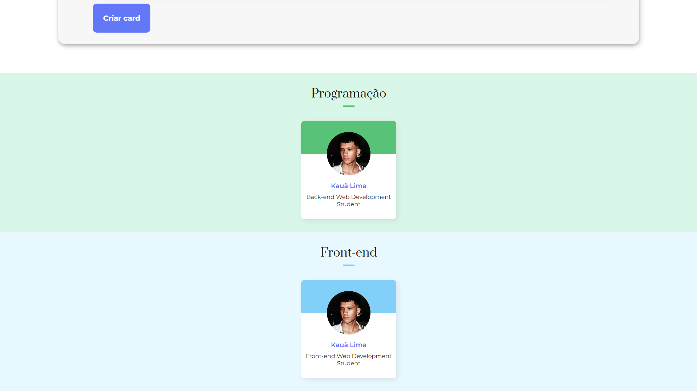

## Descrição

Aplicação web desenvolvida com React e TypeScript para gerenciar e exibir informações de equipes, permitindo adicionar e organizar membros em diferentes times.

## Screenshots da Aplicação

<p align="center">
  
</p>
<p align="center">
  
</p>
<p align="center">
  
</p>

### Requisitos

- Git
- Node.js
- Visual Studio Code

### Instalação

1. Clone o repositório:

   ```bash
   git clone https://github.com/kauatwn/organo.git
   ```

2. Instale as dependências:

   ```bash
   npm install
   ```

3. Execute o comando:

   ```bash
   npm run dev
   ```
